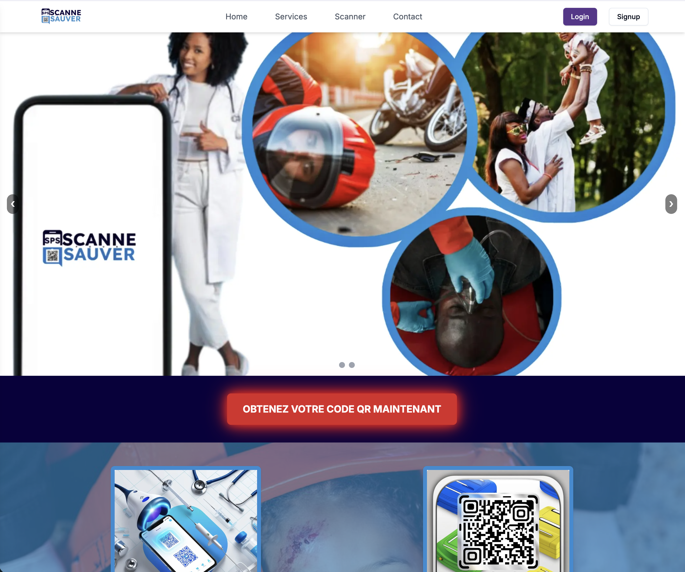
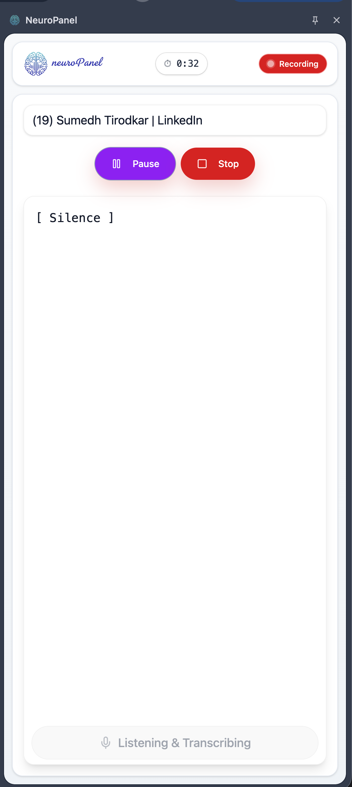
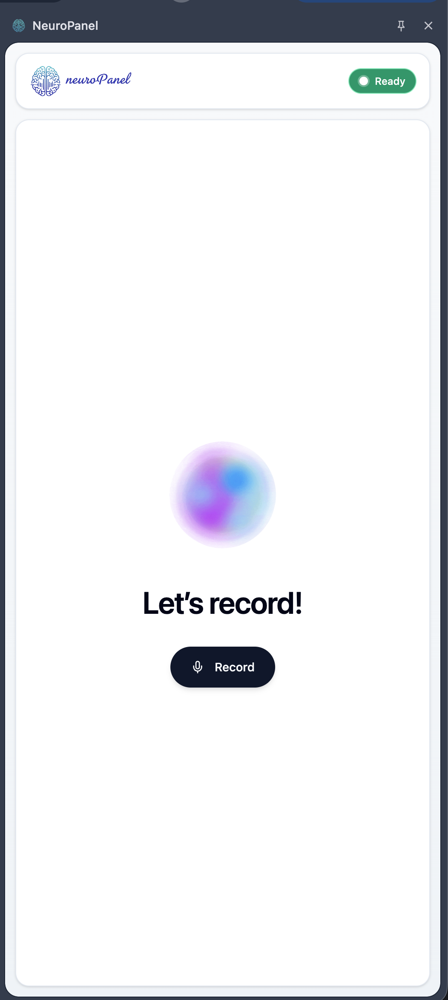
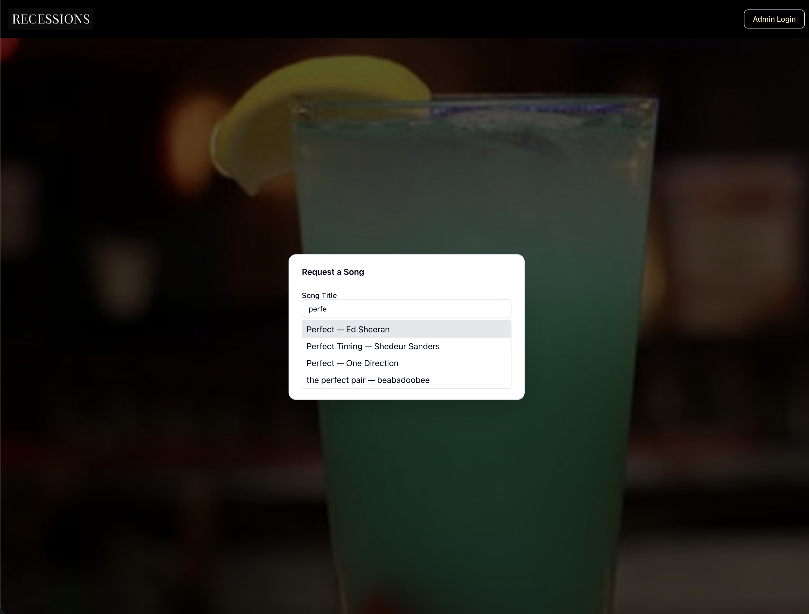
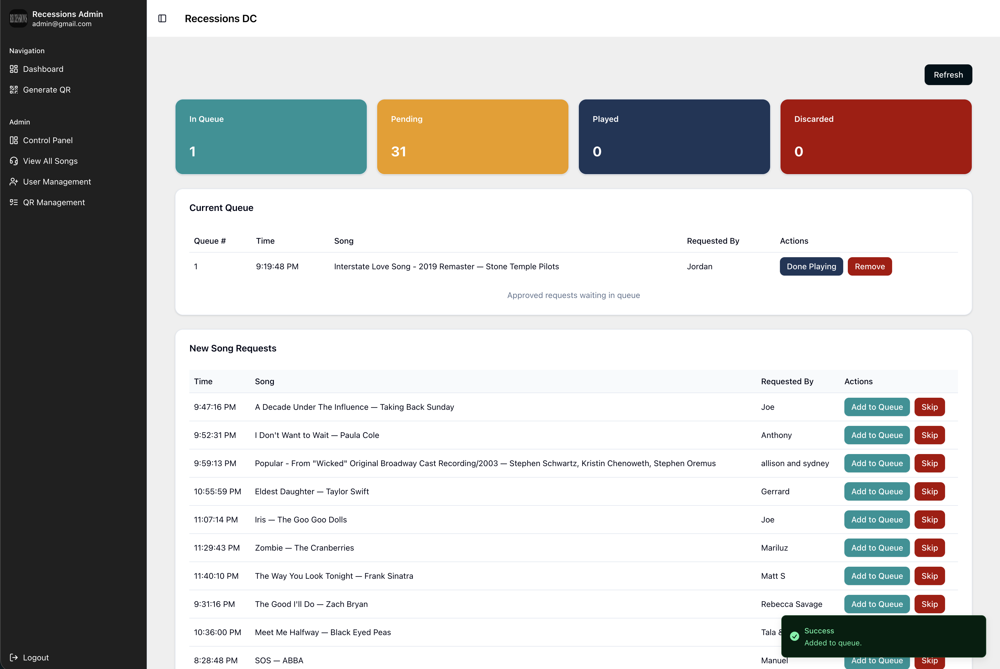
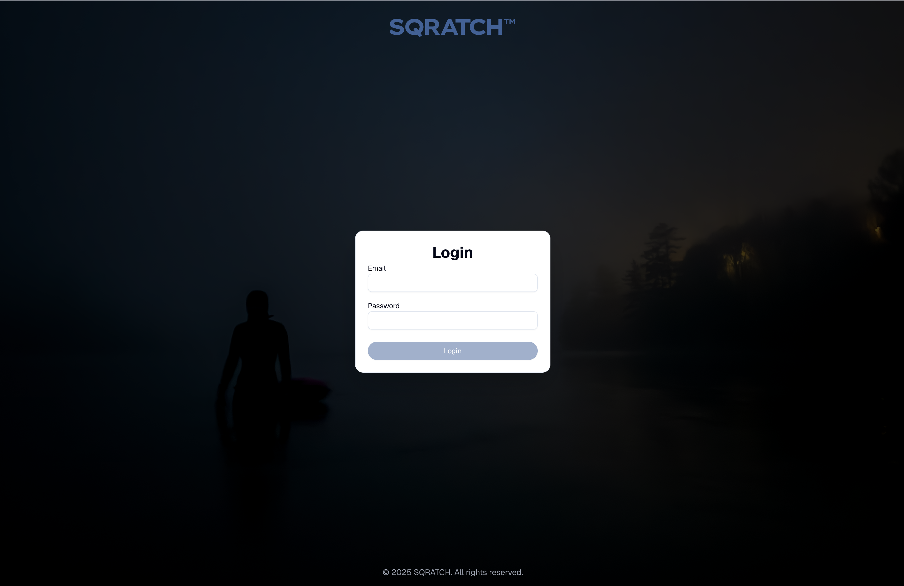

# Hi there, 👋 I'm Sumedh 🧑🏻‍💻

<!--
**sumedhTirodkar1508/sumedhtirodkar1508** is a ✨ _special_ ✨ repository because its `README.md` (this file) appears on your GitHub profile.
-->

## 💫 About Me:
- 👨‍🎓 MS in Information Systems | University of Maryland 🐢
- 🧑‍💻 Ex. Software Development Engineer at Reliance Jio
- 📫 How to reach me: sumedhtirodkar15@gmail.com
- 😄 Pronouns: he/him
- ⚡ Fun fact: I can repair just about anything! 🪛🧑‍🔧🔧

# 💻 Tech Stack:
                            

## 🧑🏻‍💻 My Skills
- Programming Languages: Java, HTML, CSS, JavaScript, Python, PHP, R
- Databases: MySQL, MongoDB, Neo4j
- Tools and Framework: Docker, Kubernetes, Git, React, Spring MVC, Spring Boot, Tableau, Jupyter, Linux, Google Colab, Azure DevOps, Eclipse, Postman, Apache JMeter, Apache Spark, jQuery, Bootstrap
- Office Tools: Microsoft Office Suite (Excel, Outlook, PowerPoint, Word)

## 📂 Featured Portfolio Projects

#### 1. [QR Code Emergency Response System ScanAndSave](https://github.com/sumedhTirodkar1508/scanAndSave)
**Tech Stack:** Next.js, TypeScript, React, PostgreSQL (Prisma ORM), Cloud Storage, RBAC
* **Live Project Link:** https://scan-and-save-nine.vercel.app/
* **Problem:** Critical medical data is often inaccessible to first responders during emergencies.
* **Solution:** Developed a secure, cloud-deployed platform allowing instant data access via QR scans. Engineered a robust Role-Based Access Control (RBAC) system to ensure data privacy and compliance.
* **Key Achievement:** Architected a mission-critical, cloud-native medical response platform ensuring instant, secure data availability during crises, while implementing an event-driven notification architecture that eliminated 100% of manual administrative intervention. 
  

#### 2. [NeuroPanel: AI Transcription Backend](https://github.com/sumedhTirodkar1508/neuroPanel)
**Tech Stack:** Next.js, React, Node.js, Gemini AI, JWT, Supabase (Edge Functions), PostgreSQL (Prisma ORM)
* **For Chrome Extension Refer Screenshot below.** **Backend Portal Link:** https://neuro-panel.vercel.app/login
* **What it does:** A full-stack Chrome extension backend delivering real-time multilingual transcription for browser audio (Meetings, YouTube, etc.).
* **Highlights:** Integrated Generative AI with fault-tolerant retry logic and fallback mechanisms to ensure high availability during API outages.
* **Security:** Secured API endpoints using NextAuth sessions and JWT verification to prevent unauthorized usage. 
   &nbsp;&nbsp;&nbsp;
  

#### 3. [Real-Time Karaoke Event Music Manager (RecessionsDC Karaoke)](https://github.com/sumedhTirodkar1508/recessionskaraoke)
**Tech Stack:** Next.js, React, Node.js, TypeScript, Real-Time Database, Supabase, PostgreSQL (Prisma ORM)
* **Problem:** High-volume event venues struggle with manual request tracking and queue fairness.
* **Solution:** Built a digital request ecosystem that allows users to submit requests via QR codes, instantly syncing with a DJ/Admin dashboard.
* **Key Achievement:** Architected a high-performance queue system integrating the Spotify API and Prisma, utilizing optimistic UI and debounced search to ensure data consistency and zero-latency interactions during concurrent submissions. 
   &nbsp;&nbsp;&nbsp;
  

#### 4. [SQRATCH: Physical-to-Digital Bridge](https://github.com/sumedhTirodkar1508/sqratch)
**Tech Stack:** Next.js, React, Node.js, Supabase (Edge Functions), PostgreSQL (Prisma ORM), Dynamic QR Generation, Authentication
* **Solution:** A gateway application connecting physical products to private digital communities using "scratchable" QR codes.
* **Highlights:** Solved the "double-spend" problem for physical goods by ensuring each QR code is unique and can only be claimed once to grant digital access.
* **Integration:** Demonstrates the ability to link physical inventory tracking with digital user authentication and community access controls. 
   &nbsp;&nbsp;&nbsp;
  

## 🌐 Let's Connect!
Feel free to explore my repositories and connect with me:
#### Socials:
  
